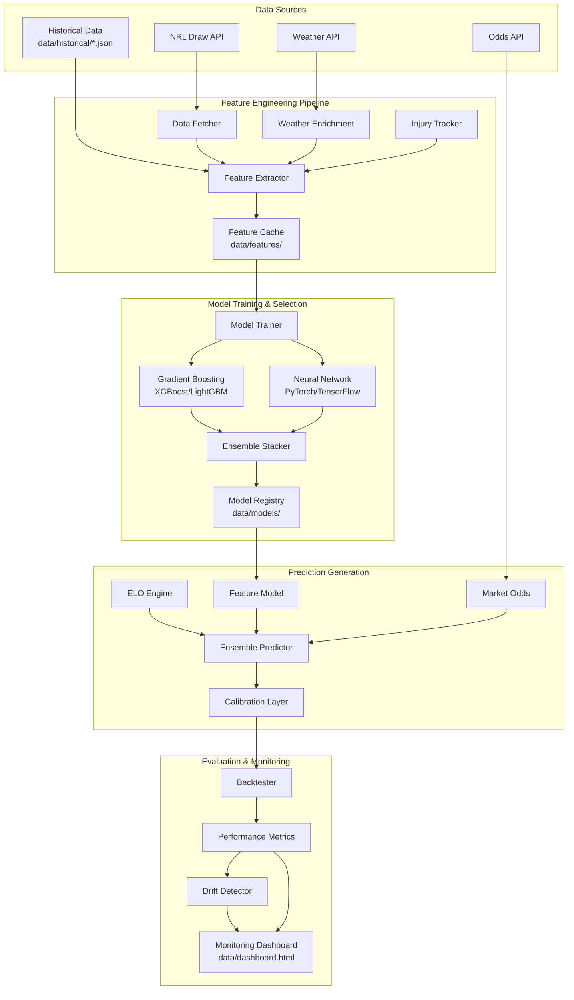

# Design Document: Prediction Model Enhancements

## Overview

This design extends the existing NRL prediction system with professional-grade capabilities including comprehensive feature engineering, data-driven model selection, continuous learning infrastructure, and proper uncertainty quantification. The enhancements maintain the serverless GitHub Actions architecture and baked JSON output format while adding weather integration, injury tracking, advanced model architectures, automated retraining, and performance monitoring.

### Design Goals

1. **Accuracy Improvement**: Achieve 65-70% prediction accuracy through richer features and optimized models
2. **Systematic Optimization**: Replace hand-tuned weights with data-driven model selection and ensemble optimization
3. **Continuous Learning**: Automatically detect performance degradation and trigger retraining
4. **Transparency**: Provide prediction explanations and confidence intervals for user trust
5. **Resilience**: Gracefully handle external API failures without blocking the pipeline
6. **Backward Compatibility**: Extend existing infrastructure without breaking changes

### Constraints

- **Serverless Execution**: All processing must complete within GitHub Actions time limits (~5 minutes)
- **No Database**: Continue using baked JSON artifacts committed to the repository
- **Python 3.13**: Maintain compatibility with existing Python environment
- **Existing Schema**: Extend `TipResult` and `ModelDiagnostics` without breaking frontend consumers
- **PEP 8 Standards**: Follow project coding conventions

## Architecture

### High-Level System Diagram




### Component Responsibilities

| Component | Responsibility | Input | Output |
|-----------|---------------|-------|--------|
| **Weather Enrichment** | Fetch and cache weather data for match venues | Fixture (venue, kickoff_at) | WeatherData |
| **Injury Tracker** | Load and persist player availability data | Team rosters, injury lists | InjuryStatus per team |
| **Feature Extractor** | Compute all predictive features | Fixture, ELO, History, Ladder, Weather, Injuries | FeatureSet |
| **Feature Cache** | Persist computed features to avoid recomputation | FeatureSet per fixture | JSON files in data/features/ |
| **Model Trainer** | Train and validate model variants | Historical features + outcomes | Trained model artifacts |
| **Model Registry** | Store and version trained models | Model artifacts + metadata | Versioned models in data/models/ |
| **Ensemble Stacker** | Optimize sub-model weights | Validation predictions | Optimized weights |
| **Calibration Layer** | Adjust probabilities for proper calibration | Raw predictions | Calibrated probabilities |
| **Drift Detector** | Monitor performance degradation | Recent predictions vs actuals | Retraining trigger signal |
| **Monitoring Dashboard** | Visualize model performance | Metrics, feature importance | Static HTML dashboard |

### Data Flow

1. **Training Phase** (triggered manually or by drift detection):
   - Load historical match results from `data/historical/*.json` and `data/archive/`
   - Enrich with weather data (cached in `data/weather_cache.json`)
   - Extract features for all historical fixtures
   - Train multiple model variants (XGBoost, LightGBM, Neural Network)
   - Evaluate via walk-forward validation
   - Select best model and optimize ensemble weights
   - Persist to Model Registry

2. **Prediction Phase** (weekly GitHub Actions run):
   - Fetch current round fixtures from NRL API
   - Enrich with weather forecast and injury data
   - Extract features using current ELO ratings and ladder
   - Load production model from registry
   - Generate predictions via ensemble
   - Apply calibration layer
   - Compute confidence intervals
   - Serialize to `data/current_round_tips.json`

3. **Evaluation Phase** (after round completion):
   - Load predictions from archive
   - Compare to actual results
   - Update performance metrics
   - Check for drift
   - Trigger retraining if needed
   - Update monitoring dashboard

## Components and Interfaces

### 1. Weather Data Integration

#### WeatherData Model

```python
@dataclass(frozen=True)
class WeatherData:
    """Weather conditions for a match venue and time."""
    
    venue: str
    timestamp: str  # ISO-8601
    temperature_c: float
    precipitation_mm: float
    wind_speed_kmh: float
    conditions: str  # "clear", "rain", "overcast", etc.
    source: str  # "openweathermap", "weatherapi", "fallback"
    cached: bool = False
```

#### Weather API Module

**File**: `scripts/lib/weather_api.py`

```python
def fetch_weather(
    venue: str,
    kickoff_at: str,
    *,
    use_cache: bool = True
) -> WeatherData | None:
    """Fetch weather data for a venue and time.
    
    Falls back to venue-season averages if API unavailable.
    Caches results to data/weather_cache.json.
    """
    pass

def get_venue_coordinates(venue: str) -> tuple[float, float] | None:
    """Map NRL venue names to lat/lon coordinates."""
    pass

def compute_venue_season_averages(
    history: list[MatchResult],
    weather_cache: dict
) -> dict[str, WeatherData]:
    """Compute average weather by venue and month for fallback."""
    pass
```


**Venue Coordinate Mapping**:

```python
VENUE_COORDINATES: dict[str, tuple[float, float]] = {
    "Accor Stadium": (-33.8474, 151.0631),
    "Suncorp Stadium": (-27.4648, 153.0095),
    "AAMI Park": (-37.8250, 144.9834),
    "CommBank Stadium": (-33.8005, 150.9820),
    "Allianz Stadium": (-33.8886, 151.2250),
    "McDonald Jones Stadium": (-32.9167, 151.7500),
    "Queensland Country Bank Stadium": (-19.2590, 146.8169),
    "GIO Stadium": (-35.2533, 149.1028),
    "Cbus Super Stadium": (-28.0667, 153.3833),
    "PointsBet Stadium": (-34.0667, 151.1333),
    "Brookvale Oval": (-33.7667, 151.2667),
    "Leichhardt Oval": (-33.8833, 151.1500),
    "Campbelltown Sports Stadium": (-34.0667, 150.8167),
    "Mt Smart Stadium": (-36.9167, 174.7833),
    "WIN Stadium": (-34.4167, 150.8833),
    "Apollo Projects Stadium": (-27.5833, 153.0500),
}
```

#### Weather Feature Extraction

Extended `FeatureSet` in `scripts/lib/features.py`:

```python
@dataclass
class FeatureSet:
    # ... existing fields ...
    
    # Weather features
    temperature_c: float = 20.0
    precipitation_mm: float = 0.0
    wind_speed_kmh: float = 10.0
    wet_weather: bool = False  # precipitation > 5mm
```

### 2. Injury and Suspension Tracking

#### InjuryStatus Model

```python
@dataclass(frozen=True)
class PlayerImpact:
    """Impact weighting for a single player."""
    
    player_name: str
    position: str
    impact_score: float  # 0.0-1.0, based on historical contribution
    status: Literal["injured", "suspended", "available"]

@dataclass(frozen=True)
class InjuryStatus:
    """Team injury/suspension status for a fixture."""
    
    team: str
    fixture_date: str
    unavailable_players: tuple[PlayerImpact, ...]
    total_impact: float  # sum of impact_scores
    key_player_out: bool  # any player with impact > 0.7
```

#### Injury Tracker Module

**File**: `scripts/lib/injury_tracker.py`

```python
def load_injury_data(
    data_path: Path | None = None
) -> dict[str, InjuryStatus]:
    """Load current injury/suspension data from JSON.
    
    Returns dict mapping team name to InjuryStatus.
    Falls back to empty status if file unavailable.
    """
    pass

def compute_team_strength_adjustment(
    injury_status: InjuryStatus
) -> float:
    """Compute ELO-equivalent adjustment for missing players.
    
    Returns negative value (e.g., -30 ELO for key player out).
    """
    pass

def persist_injury_snapshot(
    injury_data: dict[str, InjuryStatus],
    timestamp: str
) -> None:
    """Save timestamped injury snapshot for historical backtesting."""
    pass
```

**Injury Data Schema** (`data/injuries/current.json`):

```json
{
  "lastUpdated": "2026-04-15T10:00:00Z",
  "teams": {
    "Panthers": {
      "unavailablePlayers": [
        {
          "playerName": "Nathan Cleary",
          "position": "Halfback",
          "impactScore": 0.85,
          "status": "injured"
        }
      ],
      "totalImpact": 0.85,
      "keyPlayerOut": true
    }
  }
}
```


### 3. Enhanced Feature Engineering

#### Extended Feature Set

**File**: `scripts/lib/features.py` (extended)

```python
@dataclass
class FeatureSet:
    # Existing features
    elo_diff: float = 0.0
    elo_home: float = 1500.0
    elo_away: float = 1500.0
    home_advantage: float = 1.0
    form_home_5: float = 0.5
    form_away_5: float = 0.5
    pd_per_game_home: float = 0.0
    pd_per_game_away: float = 0.0
    ladder_pos_diff: int = 0
    rest_days_home: int = 7
    rest_days_away: int = 7
    h2h_home_wins_recent: int = 0
    scoring_trend_home: float = 20.0
    scoring_trend_away: float = 20.0
    defensive_trend_home: float = 20.0
    defensive_trend_away: float = 20.0
    
    # New NRL-specific features
    travel_distance_km: float = 0.0  # away team travel
    short_turnaround_home: bool = False  # < 6 days rest
    short_turnaround_away: bool = False
    state_of_origin_round: bool = False
    origin_affected_home: int = 0  # count of missing rep players
    origin_affected_away: int = 0
    venue_win_rate_home: float = 0.5  # team's win rate at this venue
    venue_win_rate_away: float = 0.5
    rivalry_game: bool = False
    finals_match: bool = False
    
    # Weather features
    temperature_c: float = 20.0
    precipitation_mm: float = 0.0
    wind_speed_kmh: float = 10.0
    wet_weather: bool = False
    
    # Injury features
    injury_impact_home: float = 0.0  # total impact score
    injury_impact_away: float = 0.0
    key_player_out_home: bool = False
    key_player_out_away: bool = False
```

#### Feature Extraction Functions

```python
def compute_travel_distance(
    away_team: str,
    venue: str
) -> float:
    """Compute great-circle distance from away team's home to venue."""
    pass

def identify_state_of_origin_rounds(
    season: int
) -> set[int]:
    """Return set of round numbers affected by State of Origin."""
    # Typically rounds 13, 15, 17 but varies by year
    pass

def compute_venue_specific_win_rate(
    team: str,
    venue: str,
    history: list[MatchResult],
    min_games: int = 5
) -> float:
    """Team's historical win rate at specific venue."""
    pass

def is_rivalry_game(
    home_team: str,
    away_team: str
) -> bool:
    """Check if fixture is a traditional rivalry."""
    # Based on predefined rivalry matrix
    pass

# Rivalry matrix (symmetric)
RIVALRY_PAIRS: set[frozenset[str]] = {
    frozenset({"Broncos", "Cowboys"}),  # QLD derby
    frozenset({"Roosters", "Rabbitohs"}),  # Sydney derby
    frozenset({"Blues", "Maroons"}),  # Origin (not club level)
    frozenset({"Storm", "Broncos"}),  # Historical finals
    frozenset({"Panthers", "Eels"}),  # Western Sydney
    # ... additional rivalries
}
```


### 4. Feature Caching System

**File**: `scripts/lib/feature_cache.py`

```python
@dataclass
class CachedFeatures:
    """Cached feature set with metadata."""
    
    game_id: str
    features: FeatureSet
    computed_at: str
    feature_version: str  # e.g., "v2.1"

def save_features(
    game_id: str,
    features: FeatureSet,
    cache_dir: Path | None = None
) -> None:
    """Persist computed features to cache."""
    cache_dir = cache_dir or Path("data/features")
    cache_dir.mkdir(parents=True, exist_ok=True)
    
    cached = CachedFeatures(
        game_id=game_id,
        features=features,
        computed_at=datetime.now(timezone.utc).isoformat(),
        feature_version="v2.1"
    )
    
    path = cache_dir / f"{game_id}.json"
    path.write_text(json.dumps(asdict(cached), indent=2))

def load_features(
    game_id: str,
    cache_dir: Path | None = None
) -> FeatureSet | None:
    """Load cached features if available and valid."""
    cache_dir = cache_dir or Path("data/features")
    path = cache_dir / f"{game_id}.json"
    
    if not path.exists():
        return None
    
    try:
        data = json.loads(path.read_text())
        # Validate feature version matches current
        if data.get("feature_version") != "v2.1":
            return None
        return FeatureSet(**data["features"])
    except (json.JSONDecodeError, TypeError, KeyError):
        return None

def extract_features_with_cache(
    fixture: Fixture,
    elo_engine: EloEngine,
    history: list[MatchResult],
    ladder: dict,
    weather_data: WeatherData | None,
    injury_data: dict[str, InjuryStatus]
) -> FeatureSet:
    """Extract features with caching layer."""
    
    # Try cache first
    cached = load_features(fixture.game_id)
    if cached is not None:
        return cached
    
    # Compute fresh
    features = extract_features(
        fixture, elo_engine, history, ladder,
        weather_data, injury_data
    )
    
    # Cache for future use
    save_features(fixture.game_id, features)
    
    return features
```

## Model Architecture

### 1. Gradient Boosting Models

**File**: `scripts/lib/models/gradient_boosting.py`

```python
from xgboost import XGBClassifier
from lightgbm import LGBMClassifier

class GradientBoostingPredictor:
    """Wrapper for gradient boosting models (XGBoost/LightGBM)."""
    
    def __init__(
        self,
        model_type: Literal["xgboost", "lightgbm"] = "xgboost",
        **hyperparams
    ):
        if model_type == "xgboost":
            self.model = XGBClassifier(
                n_estimators=hyperparams.get("n_estimators", 100),
                max_depth=hyperparams.get("max_depth", 6),
                learning_rate=hyperparams.get("learning_rate", 0.1),
                objective="binary:logistic",
                eval_metric="logloss",
                random_state=42
            )
        else:
            self.model = LGBMClassifier(
                n_estimators=hyperparams.get("n_estimators", 100),
                max_depth=hyperparams.get("max_depth", 6),
                learning_rate=hyperparams.get("learning_rate", 0.1),
                objective="binary",
                metric="binary_logloss",
                random_state=42
            )
    
    def train(
        self,
        X: np.ndarray,
        y: np.ndarray,
        X_val: np.ndarray | None = None,
        y_val: np.ndarray | None = None
    ) -> None:
        """Train model with optional early stopping."""
        if X_val is not None and y_val is not None:
            self.model.fit(
                X, y,
                eval_set=[(X_val, y_val)],
                early_stopping_rounds=10,
                verbose=False
            )
        else:
            self.model.fit(X, y)
    
    def predict_proba(self, X: np.ndarray) -> np.ndarray:
        """Return probability predictions."""
        return self.model.predict_proba(X)[:, 1]
    
    def get_feature_importance(self) -> dict[str, float]:
        """Return feature importance scores."""
        importances = self.model.feature_importances_
        return dict(zip(FEATURE_NAMES, importances))
```


### 2. Neural Network Model

**File**: `scripts/lib/models/neural_network.py`

```python
import torch
import torch.nn as nn
import torch.optim as optim

class NRLPredictionNet(nn.Module):
    """Feed-forward neural network for NRL prediction."""
    
    def __init__(
        self,
        input_dim: int,
        hidden_dims: list[int] = [64, 32, 16]
    ):
        super().__init__()
        
        layers = []
        prev_dim = input_dim
        
        for hidden_dim in hidden_dims:
            layers.extend([
                nn.Linear(prev_dim, hidden_dim),
                nn.ReLU(),
                nn.Dropout(0.2)
            ])
            prev_dim = hidden_dim
        
        layers.append(nn.Linear(prev_dim, 1))
        layers.append(nn.Sigmoid())
        
        self.network = nn.Sequential(*layers)
    
    def forward(self, x: torch.Tensor) -> torch.Tensor:
        return self.network(x)

class NeuralNetworkPredictor:
    """Wrapper for PyTorch neural network."""
    
    def __init__(
        self,
        input_dim: int,
        hidden_dims: list[int] = [64, 32, 16],
        learning_rate: float = 0.001
    ):
        self.model = NRLPredictionNet(input_dim, hidden_dims)
        self.optimizer = optim.Adam(self.model.parameters(), lr=learning_rate)
        self.criterion = nn.BCELoss()
    
    def train(
        self,
        X: np.ndarray,
        y: np.ndarray,
        X_val: np.ndarray | None = None,
        y_val: np.ndarray | None = None,
        epochs: int = 100,
        batch_size: int = 32
    ) -> None:
        """Train neural network with early stopping."""
        
        X_tensor = torch.FloatTensor(X)
        y_tensor = torch.FloatTensor(y).unsqueeze(1)
        
        dataset = torch.utils.data.TensorDataset(X_tensor, y_tensor)
        loader = torch.utils.data.DataLoader(
            dataset, batch_size=batch_size, shuffle=True
        )
        
        best_val_loss = float('inf')
        patience_counter = 0
        patience = 10
        
        for epoch in range(epochs):
            self.model.train()
            for batch_X, batch_y in loader:
                self.optimizer.zero_grad()
                outputs = self.model(batch_X)
                loss = self.criterion(outputs, batch_y)
                loss.backward()
                self.optimizer.step()
            
            # Early stopping on validation set
            if X_val is not None and y_val is not None:
                self.model.eval()
                with torch.no_grad():
                    val_outputs = self.model(torch.FloatTensor(X_val))
                    val_loss = self.criterion(
                        val_outputs,
                        torch.FloatTensor(y_val).unsqueeze(1)
                    )
                
                if val_loss < best_val_loss:
                    best_val_loss = val_loss
                    patience_counter = 0
                else:
                    patience_counter += 1
                    if patience_counter >= patience:
                        break
    
    def predict_proba(self, X: np.ndarray) -> np.ndarray:
        """Return probability predictions."""
        self.model.eval()
        with torch.no_grad():
            X_tensor = torch.FloatTensor(X)
            outputs = self.model(X_tensor)
            return outputs.squeeze().numpy()
```


### 3. Ensemble Stacking and Weight Optimization

**File**: `scripts/lib/models/ensemble.py`

```python
from scipy.optimize import minimize
from sklearn.metrics import brier_score_loss

class EnsembleOptimizer:
    """Optimize ensemble weights via constrained optimization."""
    
    def __init__(
        self,
        sub_models: list[str],  # ["elo", "features", "xgboost", "neural", "market"]
        objective: Literal["brier", "logloss", "accuracy"] = "brier"
    ):
        self.sub_models = sub_models
        self.objective = objective
        self.weights: dict[str, float] = {}
    
    def optimize_weights(
        self,
        predictions: dict[str, np.ndarray],  # model_name -> probabilities
        actuals: np.ndarray
    ) -> dict[str, float]:
        """Find optimal weights via constrained optimization.
        
        Constraints:
        - All weights >= 0
        - Sum of weights = 1.0
        """
        
        n_models = len(self.sub_models)
        
        def objective_fn(weights: np.ndarray) -> float:
            # Compute weighted ensemble prediction
            ensemble_pred = np.zeros_like(actuals, dtype=float)
            for i, model_name in enumerate(self.sub_models):
                ensemble_pred += weights[i] * predictions[model_name]
            
            if self.objective == "brier":
                return brier_score_loss(actuals, ensemble_pred)
            elif self.objective == "logloss":
                return log_loss(actuals, ensemble_pred)
            else:  # accuracy
                return -np.mean((ensemble_pred >= 0.5) == actuals)
        
        # Constraints: weights sum to 1
        constraints = {'type': 'eq', 'fun': lambda w: np.sum(w) - 1.0}
        
        # Bounds: each weight in [0, 1]
        bounds = [(0.0, 1.0) for _ in range(n_models)]
        
        # Initial guess: equal weights
        x0 = np.ones(n_models) / n_models
        
        result = minimize(
            objective_fn,
            x0,
            method='SLSQP',
            bounds=bounds,
            constraints=constraints
        )
        
        if result.success:
            self.weights = dict(zip(self.sub_models, result.x))
        else:
            # Fallback to equal weights
            self.weights = {m: 1.0 / n_models for m in self.sub_models}
        
        return self.weights
    
    def predict(
        self,
        predictions: dict[str, float]  # model_name -> probability
    ) -> float:
        """Compute weighted ensemble prediction."""
        
        # Handle missing models (e.g., market odds unavailable)
        available_models = [m for m in self.sub_models if m in predictions]
        
        if not available_models:
            return 0.5  # neutral prediction
        
        # Redistribute weights proportionally
        total_weight = sum(self.weights.get(m, 0) for m in available_models)
        
        ensemble_prob = 0.0
        for model_name in available_models:
            weight = self.weights.get(model_name, 0) / total_weight
            ensemble_prob += weight * predictions[model_name]
        
        return ensemble_prob
```

#### Weight Optimization Algorithm

```
Algorithm: Ensemble Weight Optimization

Input:
  - predictions: dict mapping model_name to probability array
  - actuals: binary outcome array (1 = home win, 0 = away win)
  - objective: "brier" | "logloss" | "accuracy"

Output:
  - weights: dict mapping model_name to optimized weight

Steps:
  1. Define objective function f(w) that computes:
     ensemble_pred = Σ(w_i * predictions_i)
     loss = brier_score(actuals, ensemble_pred)
  
  2. Set up constraints:
     - Σ(w_i) = 1.0 (weights sum to 1)
     - w_i >= 0 for all i (non-negative weights)
  
  3. Initialize w_0 = [1/n, 1/n, ..., 1/n] (equal weights)
  
  4. Run constrained optimization (SLSQP):
     w* = argmin f(w) subject to constraints
  
  5. Return optimized weights w*
```


### 4. Model Registry

**File**: `scripts/lib/model_registry.py`

```python
@dataclass
class ModelMetadata:
    """Metadata for a trained model variant."""
    
    model_id: str  # e.g., "xgboost-v1-20260415"
    model_type: str  # "xgboost", "lightgbm", "neural", "ensemble"
    trained_at: str  # ISO-8601 timestamp
    feature_version: str  # "v2.1"
    hyperparameters: dict
    
    # Performance metrics
    accuracy: float
    brier_score: float
    log_loss: float
    calibration_error: float
    
    # Training data
    train_seasons: list[int]
    train_games: int
    validation_games: int
    
    # Feature importance (top 10)
    feature_importance: dict[str, float]

class ModelRegistry:
    """Manage trained model artifacts and metadata."""
    
    def __init__(self, registry_dir: Path | None = None):
        self.registry_dir = registry_dir or Path("data/models")
        self.registry_dir.mkdir(parents=True, exist_ok=True)
    
    def save_model(
        self,
        model: Any,  # trained model object
        metadata: ModelMetadata
    ) -> Path:
        """Persist model and metadata to registry."""
        
        model_dir = self.registry_dir / metadata.model_id
        model_dir.mkdir(parents=True, exist_ok=True)
        
        # Save metadata
        meta_path = model_dir / "metadata.json"
        meta_path.write_text(
            json.dumps(asdict(metadata), indent=2)
        )
        
        # Save model artifact (format depends on model type)
        if metadata.model_type in ["xgboost", "lightgbm"]:
            model_path = model_dir / "model.json"
            model.save_model(str(model_path))
        elif metadata.model_type == "neural":
            model_path = model_dir / "model.pt"
            torch.save(model.state_dict(), model_path)
        else:  # ensemble weights
            model_path = model_dir / "weights.json"
            model_path.write_text(json.dumps(model, indent=2))
        
        return model_dir
    
    def load_model(
        self,
        model_id: str
    ) -> tuple[Any, ModelMetadata]:
        """Load model and metadata from registry."""
        
        model_dir = self.registry_dir / model_id
        if not model_dir.exists():
            raise FileNotFoundError(f"Model {model_id} not found")
        
        # Load metadata
        meta_path = model_dir / "metadata.json"
        metadata = ModelMetadata(**json.loads(meta_path.read_text()))
        
        # Load model artifact
        if metadata.model_type == "xgboost":
            from xgboost import XGBClassifier
            model = XGBClassifier()
            model.load_model(str(model_dir / "model.json"))
        elif metadata.model_type == "lightgbm":
            from lightgbm import LGBMClassifier
            model = LGBMClassifier()
            model.booster_ = lgb.Booster(model_file=str(model_dir / "model.txt"))
        elif metadata.model_type == "neural":
            model = NRLPredictionNet(input_dim=len(FEATURE_NAMES))
            model.load_state_dict(torch.load(model_dir / "model.pt"))
        else:  # ensemble weights
            model = json.loads((model_dir / "weights.json").read_text())
        
        return model, metadata
    
    def get_production_model(self) -> str:
        """Return model_id of current production model."""
        prod_link = self.registry_dir / "production"
        if prod_link.exists():
            return prod_link.read_text().strip()
        return ""
    
    def set_production_model(self, model_id: str) -> None:
        """Promote a model to production."""
        prod_link = self.registry_dir / "production"
        prod_link.write_text(model_id)
    
    def list_models(self) -> list[ModelMetadata]:
        """List all registered models sorted by training date."""
        models = []
        for model_dir in self.registry_dir.iterdir():
            if not model_dir.is_dir():
                continue
            meta_path = model_dir / "metadata.json"
            if meta_path.exists():
                metadata = ModelMetadata(**json.loads(meta_path.read_text()))
                models.append(metadata)
        
        return sorted(models, key=lambda m: m.trained_at, reverse=True)
```


## Data Management

### Historical Data Storage

**Directory Structure**:

```
data/
├── historical/
│   ├── 2023.json          # Complete season results
│   ├── 2024.json
│   ├── 2025.json
│   └── 2026.json
├── features/
│   ├── 2025-r01-g01.json  # Cached features per game
│   ├── 2025-r01-g02.json
│   └── ...
├── models/
│   ├── xgboost-v1-20260415/
│   │   ├── metadata.json
│   │   └── model.json
│   ├── neural-v1-20260415/
│   │   ├── metadata.json
│   │   └── model.pt
│   ├── ensemble-v2-20260420/
│   │   ├── metadata.json
│   │   └── weights.json
│   └── production         # Symlink/pointer to active model
├── weather_cache.json     # Cached weather data
├── injuries/
│   ├── current.json       # Latest injury status
│   └── snapshots/
│       ├── 2026-04-15.json
│       └── 2026-04-22.json
├── elo_ratings.json       # Current ELO state
├── performance_log.json   # Model performance tracking
└── dashboard.html         # Monitoring dashboard
```

### Feature Cache Schema

**File**: `data/features/2025-r01-g01.json`

```json
{
  "game_id": "2025-r01-g01",
  "computed_at": "2026-04-15T10:30:00Z",
  "feature_version": "v2.1",
  "features": {
    "elo_diff": 45.2,
    "home_advantage": 1.0,
    "form_home_5": 0.6,
    "form_away_5": 0.4,
    "travel_distance_km": 850.0,
    "temperature_c": 22.5,
    "precipitation_mm": 0.0,
    "wet_weather": false,
    "injury_impact_home": 0.0,
    "injury_impact_away": 0.85,
    "key_player_out_away": true
  }
}
```

### Model Metadata Schema

**File**: `data/models/xgboost-v1-20260415/metadata.json`

```json
{
  "model_id": "xgboost-v1-20260415",
  "model_type": "xgboost",
  "trained_at": "2026-04-15T12:00:00Z",
  "feature_version": "v2.1",
  "hyperparameters": {
    "n_estimators": 100,
    "max_depth": 6,
    "learning_rate": 0.1
  },
  "accuracy": 0.672,
  "brier_score": 0.198,
  "log_loss": 0.542,
  "calibration_error": 0.032,
  "train_seasons": [2023, 2024, 2025],
  "train_games": 648,
  "validation_games": 216,
  "feature_importance": {
    "elo_diff": 0.285,
    "form_diff": 0.142,
    "ladder_pos_diff": 0.098,
    "injury_impact_away": 0.087,
    "travel_distance_km": 0.065,
    "wet_weather": 0.052,
    "rest_days_diff": 0.048,
    "venue_win_rate_home": 0.043,
    "h2h_advantage": 0.038,
    "temperature_c": 0.025
  }
}
```

## Evaluation Framework

### 1. Enhanced Backtesting Engine

**File**: `scripts/lib/backtester.py` (extended)

```python
@dataclass
class DetailedBacktestResult:
    """Extended backtest result with additional metrics."""
    
    season: int
    round_number: int
    total_games: int
    correct_predictions: int
    accuracy: float
    brier_score: float
    log_loss: float
    calibration_error: float
    
    # Breakdown by context
    regular_season_accuracy: float
    finals_accuracy: float
    rivalry_game_accuracy: float
    
    # Per-team performance
    team_accuracy: dict[str, float]
    
    predictions: list[GamePrediction]

def run_enhanced_backtest(
    history: list[MatchResult],
    model_type: str = "ensemble",
    start_season: int = 2025,
    start_round: int = 1
) -> list[DetailedBacktestResult]:
    """Walk-forward backtesting with detailed metrics."""
    pass

def compute_calibration_curve(
    predictions: list[GamePrediction],
    n_bins: int = 10
) -> tuple[np.ndarray, np.ndarray]:
    """Compute calibration curve (predicted vs actual frequencies)."""
    
    probs = np.array([p.confidence for p in predictions])
    outcomes = np.array([1.0 if p.correct else 0.0 for p in predictions])
    
    bin_edges = np.linspace(0, 1, n_bins + 1)
    bin_centers = (bin_edges[:-1] + bin_edges[1:]) / 2
    bin_freqs = np.zeros(n_bins)
    
    for i in range(n_bins):
        mask = (probs >= bin_edges[i]) & (probs < bin_edges[i + 1])
        if mask.sum() > 0:
            bin_freqs[i] = outcomes[mask].mean()
    
    return bin_centers, bin_freqs

def compute_expected_calibration_error(
    predictions: list[GamePrediction],
    n_bins: int = 10
) -> float:
    """Compute Expected Calibration Error (ECE)."""
    
    bin_centers, bin_freqs = compute_calibration_curve(predictions, n_bins)
    
    probs = np.array([p.confidence for p in predictions])
    ece = 0.0
    
    bin_edges = np.linspace(0, 1, n_bins + 1)
    for i in range(n_bins):
        mask = (probs >= bin_edges[i]) & (probs < bin_edges[i + 1])
        if mask.sum() > 0:
            bin_weight = mask.sum() / len(probs)
            ece += bin_weight * abs(bin_centers[i] - bin_freqs[i])
    
    return ece
```


### 2. Calibration Layer

**File**: `scripts/lib/calibration.py`

```python
from sklearn.isotonic import IsotonicRegression
from sklearn.linear_model import LogisticRegression

class CalibrationLayer:
    """Post-hoc probability calibration using Platt scaling or isotonic regression."""
    
    def __init__(
        self,
        method: Literal["platt", "isotonic"] = "isotonic"
    ):
        self.method = method
        if method == "platt":
            self.calibrator = LogisticRegression()
        else:
            self.calibrator = IsotonicRegression(out_of_bounds='clip')
    
    def fit(
        self,
        raw_probs: np.ndarray,
        actuals: np.ndarray
    ) -> None:
        """Fit calibration model on validation data."""
        
        if self.method == "platt":
            # Platt scaling: logistic regression on raw probabilities
            self.calibrator.fit(raw_probs.reshape(-1, 1), actuals)
        else:
            # Isotonic regression: monotonic mapping
            self.calibrator.fit(raw_probs, actuals)
    
    def calibrate(self, raw_prob: float) -> float:
        """Apply calibration to a single probability."""
        
        if self.method == "platt":
            return self.calibrator.predict_proba([[raw_prob]])[0, 1]
        else:
            return self.calibrator.predict([raw_prob])[0]
    
    def calibrate_batch(self, raw_probs: np.ndarray) -> np.ndarray:
        """Apply calibration to a batch of probabilities."""
        
        if self.method == "platt":
            return self.calibrator.predict_proba(raw_probs.reshape(-1, 1))[:, 1]
        else:
            return self.calibrator.predict(raw_probs)
```

### 3. Uncertainty Quantification

**File**: `scripts/lib/uncertainty.py`

```python
def compute_confidence_interval(
    predictions: list[float],  # bootstrap sample predictions
    confidence_level: float = 0.90
) -> tuple[float, float]:
    """Compute confidence interval from bootstrap samples."""
    
    alpha = 1 - confidence_level
    lower_percentile = (alpha / 2) * 100
    upper_percentile = (1 - alpha / 2) * 100
    
    lower = np.percentile(predictions, lower_percentile)
    upper = np.percentile(predictions, upper_percentile)
    
    return lower, upper

def bootstrap_prediction(
    fixture: Fixture,
    ensemble_predictor: EnsemblePredictor,
    n_samples: int = 100
) -> tuple[float, float, float]:
    """Generate prediction with confidence interval via bootstrap.
    
    Returns:
        (mean_probability, lower_bound, upper_bound)
    """
    
    # Generate bootstrap samples by perturbing features
    base_features = ensemble_predictor.extract_features(fixture)
    
    bootstrap_predictions = []
    for _ in range(n_samples):
        # Add small Gaussian noise to features
        perturbed_features = add_feature_noise(base_features, noise_scale=0.05)
        prob = ensemble_predictor.predict_with_features(perturbed_features)
        bootstrap_predictions.append(prob)
    
    mean_prob = np.mean(bootstrap_predictions)
    lower, upper = compute_confidence_interval(bootstrap_predictions, 0.90)
    
    return mean_prob, lower, upper

def add_feature_noise(
    features: FeatureSet,
    noise_scale: float = 0.05
) -> FeatureSet:
    """Add Gaussian noise to numeric features for bootstrap sampling."""
    
    # Create mutable copy
    feature_dict = asdict(features)
    
    # Add noise to numeric features only
    numeric_features = [
        "elo_diff", "form_home_5", "form_away_5",
        "pd_per_game_home", "pd_per_game_away",
        "rest_days_home", "rest_days_away",
        "temperature_c", "wind_speed_kmh"
    ]
    
    for key in numeric_features:
        if key in feature_dict:
            original = feature_dict[key]
            noise = np.random.normal(0, abs(original) * noise_scale)
            feature_dict[key] = original + noise
    
    return FeatureSet(**feature_dict)
```


## Continuous Learning

### 1. Automated Retraining Pipeline

**File**: `scripts/lib/retraining.py`

```python
@dataclass
class RetrainingEvent:
    """Record of a retraining event."""
    
    triggered_at: str
    trigger_reason: str  # "drift_detected", "manual", "scheduled"
    rolling_accuracy: float
    threshold: float
    
    old_model_id: str
    new_model_id: str
    
    performance_delta: dict[str, float]  # metric -> change
    promoted: bool  # whether new model was promoted to production

class RetrainingTrigger:
    """Monitor performance and trigger retraining when needed."""
    
    def __init__(
        self,
        accuracy_threshold: float = 0.55,
        window_size: int = 4  # rounds
    ):
        self.accuracy_threshold = accuracy_threshold
        self.window_size = window_size
    
    def check_drift(
        self,
        recent_predictions: list[GamePrediction]
    ) -> tuple[bool, float]:
        """Check if rolling accuracy has dropped below threshold.
        
        Returns:
            (should_retrain, rolling_accuracy)
        """
        
        if len(recent_predictions) < self.window_size:
            return False, 1.0
        
        # Compute rolling accuracy over last N rounds
        window = recent_predictions[-self.window_size:]
        correct = sum(1 for p in window if p.correct)
        rolling_acc = correct / len(window)
        
        should_retrain = rolling_acc < self.accuracy_threshold
        
        return should_retrain, rolling_acc
    
    def execute_retraining(
        self,
        trigger_reason: str,
        rolling_accuracy: float
    ) -> RetrainingEvent:
        """Execute full retraining pipeline."""
        
        print(f"Retraining triggered: {trigger_reason}")
        print(f"Rolling accuracy: {rolling_accuracy:.1%}")
        
        # 1. Rebuild ELO from all historical data
        from scripts.lib.elo_ratings import build_elo_from_history
        from scripts.lib.historical_data import load_all_history
        
        history = load_all_history()
        elo_engine = build_elo_from_history(history)
        elo_engine.save(Path("data/elo_ratings.json"))
        
        # 2. Train new model variants
        from scripts.lib.model_trainer import train_all_models
        
        new_models = train_all_models(history, elo_engine)
        
        # 3. Evaluate on holdout set
        best_model_id = select_best_model(new_models)
        
        # 4. Compare to current production model
        registry = ModelRegistry()
        old_model_id = registry.get_production_model()
        
        should_promote = compare_models(old_model_id, best_model_id)
        
        if should_promote:
            registry.set_production_model(best_model_id)
            print(f"Promoted {best_model_id} to production")
        else:
            print(f"Retained {old_model_id} in production")
        
        # 5. Log retraining event
        event = RetrainingEvent(
            triggered_at=datetime.now(timezone.utc).isoformat(),
            trigger_reason=trigger_reason,
            rolling_accuracy=rolling_accuracy,
            threshold=self.accuracy_threshold,
            old_model_id=old_model_id,
            new_model_id=best_model_id,
            performance_delta={},  # populated by compare_models
            promoted=should_promote
        )
        
        log_retraining_event(event)
        
        return event

def log_retraining_event(event: RetrainingEvent) -> None:
    """Append retraining event to log file."""
    
    log_path = Path("data/retraining_log.json")
    
    if log_path.exists():
        log = json.loads(log_path.read_text())
    else:
        log = {"events": []}
    
    log["events"].append(asdict(event))
    
    log_path.write_text(json.dumps(log, indent=2))
```


### 2. Model Trainer

**File**: `scripts/lib/model_trainer.py`

```python
def prepare_training_data(
    history: list[MatchResult],
    elo_engine: EloEngine,
    train_seasons: list[int],
    val_seasons: list[int]
) -> tuple[np.ndarray, np.ndarray, np.ndarray, np.ndarray]:
    """Prepare feature matrices and labels for training.
    
    Returns:
        (X_train, y_train, X_val, y_val)
    """
    
    # Load ladder and weather data
    ladder = load_seed_ladder()
    weather_cache = load_weather_cache()
    injury_data = load_injury_data()
    
    # Extract features for all historical games
    train_features = []
    train_labels = []
    val_features = []
    val_labels = []
    
    for result in history:
        # Reconstruct fixture from result
        fixture = result_to_fixture(result)
        
        # Extract features
        features = extract_features(
            fixture, elo_engine, history, ladder,
            weather_cache.get(result.game_id),
            injury_data
        )
        
        feature_vec = feature_vector(features)
        label = 1.0 if result.winner == result.home_team else 0.0
        
        if result.season in train_seasons:
            train_features.append(feature_vec)
            train_labels.append(label)
        elif result.season in val_seasons:
            val_features.append(feature_vec)
            val_labels.append(label)
    
    return (
        np.array(train_features),
        np.array(train_labels),
        np.array(val_features),
        np.array(val_labels)
    )

def train_all_models(
    history: list[MatchResult],
    elo_engine: EloEngine
) -> list[str]:
    """Train all model variants and return model IDs.
    
    Trains:
    - XGBoost with default hyperparameters
    - LightGBM with default hyperparameters
    - Neural network with [64, 32, 16] architecture
    - Ensemble with optimized weights
    """
    
    # Prepare data: train on 2023-2024, validate on 2025
    X_train, y_train, X_val, y_val = prepare_training_data(
        history, elo_engine,
        train_seasons=[2023, 2024],
        val_seasons=[2025]
    )
    
    registry = ModelRegistry()
    model_ids = []
    
    # Train XGBoost
    print("Training XGBoost...")
    xgb_model = GradientBoostingPredictor(model_type="xgboost")
    xgb_model.train(X_train, y_train, X_val, y_val)
    
    xgb_metadata = evaluate_model(xgb_model, X_val, y_val, "xgboost")
    xgb_id = f"xgboost-v1-{datetime.now().strftime('%Y%m%d')}"
    xgb_metadata.model_id = xgb_id
    registry.save_model(xgb_model.model, xgb_metadata)
    model_ids.append(xgb_id)
    
    # Train LightGBM
    print("Training LightGBM...")
    lgb_model = GradientBoostingPredictor(model_type="lightgbm")
    lgb_model.train(X_train, y_train, X_val, y_val)
    
    lgb_metadata = evaluate_model(lgb_model, X_val, y_val, "lightgbm")
    lgb_id = f"lightgbm-v1-{datetime.now().strftime('%Y%m%d')}"
    lgb_metadata.model_id = lgb_id
    registry.save_model(lgb_model.model, lgb_metadata)
    model_ids.append(lgb_id)
    
    # Train Neural Network
    print("Training Neural Network...")
    nn_model = NeuralNetworkPredictor(input_dim=len(FEATURE_NAMES))
    nn_model.train(X_train, y_train, X_val, y_val, epochs=100)
    
    nn_metadata = evaluate_model(nn_model, X_val, y_val, "neural")
    nn_id = f"neural-v1-{datetime.now().strftime('%Y%m%d')}"
    nn_metadata.model_id = nn_id
    registry.save_model(nn_model.model, nn_metadata)
    model_ids.append(nn_id)
    
    # Optimize ensemble weights
    print("Optimizing ensemble weights...")
    predictions = {
        "xgboost": xgb_model.predict_proba(X_val),
        "lightgbm": lgb_model.predict_proba(X_val),
        "neural": nn_model.predict_proba(X_val)
    }
    
    optimizer = EnsembleOptimizer(
        sub_models=["xgboost", "lightgbm", "neural"],
        objective="brier"
    )
    weights = optimizer.optimize_weights(predictions, y_val)
    
    ensemble_id = f"ensemble-v2-{datetime.now().strftime('%Y%m%d')}"
    ensemble_metadata = ModelMetadata(
        model_id=ensemble_id,
        model_type="ensemble",
        trained_at=datetime.now(timezone.utc).isoformat(),
        feature_version="v2.1",
        hyperparameters={"weights": weights},
        accuracy=0.0,  # computed by evaluate_ensemble
        brier_score=0.0,
        log_loss=0.0,
        calibration_error=0.0,
        train_seasons=[2023, 2024],
        train_games=len(X_train),
        validation_games=len(X_val),
        feature_importance={}
    )
    registry.save_model(weights, ensemble_metadata)
    model_ids.append(ensemble_id)
    
    return model_ids

def evaluate_model(
    model: Any,
    X_val: np.ndarray,
    y_val: np.ndarray,
    model_type: str
) -> ModelMetadata:
    """Evaluate model on validation set and return metadata."""
    
    probs = model.predict_proba(X_val)
    preds = (probs >= 0.5).astype(int)
    
    accuracy = (preds == y_val).mean()
    brier = brier_score_loss(y_val, probs)
    logloss = log_loss(y_val, probs)
    
    # Compute calibration error
    cal_error = compute_expected_calibration_error(
        [GamePrediction("", "", "", "", "", p, c)
         for p, c in zip(probs, y_val == 1)]
    )
    
    # Get feature importance
    if hasattr(model, 'get_feature_importance'):
        importance = model.get_feature_importance()
    else:
        importance = {}
    
    return ModelMetadata(
        model_id="",  # set by caller
        model_type=model_type,
        trained_at=datetime.now(timezone.utc).isoformat(),
        feature_version="v2.1",
        hyperparameters={},
        accuracy=round(accuracy, 4),
        brier_score=round(brier, 4),
        log_loss=round(logloss, 4),
        calibration_error=round(cal_error, 4),
        train_seasons=[2023, 2024],
        train_games=0,  # set by caller
        validation_games=len(X_val),
        feature_importance=importance
    )
```


## Monitoring & Observability

### 1. Performance Dashboard

**File**: `scripts/lib/dashboard_generator.py`

```python
def generate_dashboard(
    performance_log: dict,
    feature_importance: dict[str, float],
    calibration_data: tuple[np.ndarray, np.ndarray],
    recent_predictions: list[GamePrediction]
) -> str:
    """Generate static HTML dashboard with performance visualizations."""
    
    html = f"""
    <!DOCTYPE html>
    <html>
    <head>
        <title>NRL Prediction Model Dashboard</title>
        <script src="https://cdn.plot.ly/plotly-2.18.0.min.js"></script>
        <style>
            body {{ font-family: Arial, sans-serif; margin: 20px; }}
            .metric {{ display: inline-block; margin: 20px; padding: 15px;
                      background: #f0f0f0; border-radius: 5px; }}
            .metric-value {{ font-size: 2em; font-weight: bold; }}
            .metric-label {{ font-size: 0.9em; color: #666; }}
            .chart {{ margin: 20px 0; }}
        </style>
    </head>
    <body>
        <h1>NRL Prediction Model Dashboard</h1>
        <p>Last updated: {datetime.now().strftime('%Y-%m-%d %H:%M:%S')}</p>
        
        <div id="metrics">
            {generate_metric_cards(performance_log)}
        </div>
        
        <div class="chart" id="accuracy-trend"></div>
        <div class="chart" id="calibration-curve"></div>
        <div class="chart" id="feature-importance"></div>
        <div class="chart" id="confidence-distribution"></div>
        
        <script>
            {generate_plotly_charts(
                performance_log,
                feature_importance,
                calibration_data,
                recent_predictions
            )}
        </script>
    </body>
    </html>
    """
    
    return html

def generate_metric_cards(performance_log: dict) -> str:
    """Generate HTML for metric summary cards."""
    
    latest = performance_log.get("latest", {})
    
    cards = []
    metrics = [
        ("Accuracy", latest.get("accuracy", 0), "%"),
        ("Brier Score", latest.get("brier_score", 0), ""),
        ("Log Loss", latest.get("log_loss", 0), ""),
        ("Calibration Error", latest.get("calibration_error", 0), "")
    ]
    
    for label, value, unit in metrics:
        cards.append(f"""
            <div class="metric">
                <div class="metric-value">{value:.3f}{unit}</div>
                <div class="metric-label">{label}</div>
            </div>
        """)
    
    return "\n".join(cards)

def generate_plotly_charts(
    performance_log: dict,
    feature_importance: dict[str, float],
    calibration_data: tuple[np.ndarray, np.ndarray],
    recent_predictions: list[GamePrediction]
) -> str:
    """Generate Plotly.js chart definitions."""
    
    # Accuracy trend over time
    rounds = [r["round"] for r in performance_log.get("history", [])]
    accuracies = [r["accuracy"] for r in performance_log.get("history", [])]
    
    accuracy_chart = f"""
    Plotly.newPlot('accuracy-trend', [{{
        x: {rounds},
        y: {accuracies},
        type: 'scatter',
        mode: 'lines+markers',
        name: 'Accuracy'
    }}], {{
        title: 'Rolling 4-Round Accuracy',
        xaxis: {{ title: 'Round' }},
        yaxis: {{ title: 'Accuracy', range: [0, 1] }}
    }});
    """
    
    # Calibration curve
    bin_centers, bin_freqs = calibration_data
    
    calibration_chart = f"""
    Plotly.newPlot('calibration-curve', [
        {{
            x: {list(bin_centers)},
            y: {list(bin_freqs)},
            type: 'scatter',
            mode: 'lines+markers',
            name: 'Actual'
        }},
        {{
            x: [0, 1],
            y: [0, 1],
            type: 'scatter',
            mode: 'lines',
            name: 'Perfect Calibration',
            line: {{ dash: 'dash', color: 'gray' }}
        }}
    ], {{
        title: 'Calibration Curve',
        xaxis: {{ title: 'Predicted Probability' }},
        yaxis: {{ title: 'Actual Frequency' }}
    }});
    """
    
    # Feature importance
    features = list(feature_importance.keys())[:10]
    importances = [feature_importance[f] for f in features]
    
    importance_chart = f"""
    Plotly.newPlot('feature-importance', [{{
        x: {importances},
        y: {features},
        type: 'bar',
        orientation: 'h'
    }}], {{
        title: 'Top 10 Feature Importance',
        xaxis: {{ title: 'Importance Score' }},
        margin: {{ l: 150 }}
    }});
    """
    
    # Confidence distribution
    confidences = [p.confidence for p in recent_predictions]
    
    confidence_chart = f"""
    Plotly.newPlot('confidence-distribution', [{{
        x: {confidences},
        type: 'histogram',
        nbinsx: 20
    }}], {{
        title: 'Prediction Confidence Distribution',
        xaxis: {{ title: 'Confidence', range: [0.5, 1.0] }},
        yaxis: {{ title: 'Count' }}
    }});
    """
    
    return "\n".join([
        accuracy_chart,
        calibration_chart,
        importance_chart,
        confidence_chart
    ])

def update_dashboard() -> None:
    """Generate and save dashboard to data/dashboard.html."""
    
    # Load performance log
    log_path = Path("data/performance_log.json")
    if log_path.exists():
        performance_log = json.loads(log_path.read_text())
    else:
        performance_log = {}
    
    # Load feature importance from production model
    registry = ModelRegistry()
    model_id = registry.get_production_model()
    if model_id:
        _, metadata = registry.load_model(model_id)
        feature_importance = metadata.feature_importance
    else:
        feature_importance = {}
    
    # Load recent predictions for calibration
    recent_predictions = load_recent_predictions()
    
    if recent_predictions:
        calibration_data = compute_calibration_curve(recent_predictions)
    else:
        calibration_data = (np.array([]), np.array([]))
    
    # Generate HTML
    html = generate_dashboard(
        performance_log,
        feature_importance,
        calibration_data,
        recent_predictions
    )
    
    # Save to file
    dashboard_path = Path("data/dashboard.html")
    dashboard_path.write_text(html)
    
    print(f"Dashboard updated: {dashboard_path}")
```


### 2. Prediction Explainability

**File**: `scripts/lib/explainability.py`

```python
def explain_prediction(
    fixture: Fixture,
    features: FeatureSet,
    sub_predictions: tuple[SubPrediction, ...],
    final_probability: float
) -> str:
    """Generate human-readable explanation for a prediction."""
    
    # Identify top contributing features
    feature_contributions = compute_feature_contributions(features)
    top_positive = sorted(
        [(k, v) for k, v in feature_contributions.items() if v > 0],
        key=lambda x: x[1],
        reverse=True
    )[:3]
    top_negative = sorted(
        [(k, v) for k, v in feature_contributions.items() if v < 0],
        key=lambda x: x[1]
    )[:3]
    
    # Build explanation
    winner = fixture.home_team if final_probability >= 0.5 else fixture.away_team
    confidence_pct = final_probability * 100 if final_probability >= 0.5 else (1 - final_probability) * 100
    
    explanation = f"{winner} favored ({confidence_pct:.1f}% confidence)\n\n"
    
    # Key factors supporting the prediction
    if top_positive:
        explanation += "Supporting factors:\n"
        for feature, contribution in top_positive:
            explanation += f"  • {format_feature_contribution(feature, contribution, features)}\n"
    
    # Key factors against the prediction
    if top_negative:
        explanation += "\nCountering factors:\n"
        for feature, contribution in top_negative:
            explanation += f"  • {format_feature_contribution(feature, contribution, features)}\n"
    
    # Sub-model agreement
    explanation += "\nModel agreement:\n"
    home_votes = sum(1 for sp in sub_predictions if sp.tip_team == fixture.home_team)
    away_votes = len(sub_predictions) - home_votes
    
    if home_votes == len(sub_predictions) or away_votes == len(sub_predictions):
        explanation += "  • All models agree\n"
    else:
        explanation += f"  • Split decision ({home_votes} for {fixture.home_team}, {away_votes} for {fixture.away_team})\n"
        for sp in sub_predictions:
            explanation += f"    - {sp.model_name}: {sp.tip_team} ({sp.confidence:.1%})\n"
    
    return explanation

def compute_feature_contributions(features: FeatureSet) -> dict[str, float]:
    """Compute approximate contribution of each feature to prediction.
    
    Uses feature weights from the logistic model as proxy.
    """
    
    from scripts.lib.model import FEATURE_WEIGHTS
    
    feature_vec = feature_vector(features)
    contributions = {}
    
    for name, value, weight in zip(FEATURE_NAMES, feature_vec, FEATURE_WEIGHTS):
        contributions[name] = value * weight
    
    return contributions

def format_feature_contribution(
    feature_name: str,
    contribution: float,
    features: FeatureSet
) -> str:
    """Format a feature contribution as human-readable text."""
    
    templates = {
        "elo_diff": f"ELO advantage ({features.elo_diff:+.0f} points): {contribution:+.2f}",
        "form_diff": f"Recent form edge ({features.form_home_5 - features.form_away_5:+.2f}): {contribution:+.2f}",
        "rest_days_diff": f"Rest advantage ({features.rest_days_home - features.rest_days_away:+d} days): {contribution:+.2f}",
        "travel_distance_km": f"Travel burden ({features.travel_distance_km:.0f} km): {contribution:+.2f}",
        "injury_impact_away": f"Opposition injuries (impact {features.injury_impact_away:.2f}): {contribution:+.2f}",
        "wet_weather": f"Wet weather conditions: {contribution:+.2f}",
        "venue_win_rate_home": f"Home venue advantage ({features.venue_win_rate_home:.1%} win rate): {contribution:+.2f}",
    }
    
    return templates.get(feature_name, f"{feature_name}: {contribution:+.2f}")
```

## Configuration & Deployment

### 1. Configuration Management

**File**: `config/model_config.yaml`

```yaml
# Model Configuration
model:
  version: "v2.1"
  
  # Feature engineering
  features:
    version: "v2.1"
    enable_weather: true
    enable_injuries: true
    enable_travel: true
    enable_origin_tracking: true
  
  # Model selection
  ensemble:
    sub_models:
      - elo
      - xgboost
      - neural
      - market
    optimization_objective: "brier"  # brier | logloss | accuracy
    
  # Calibration
  calibration:
    enabled: true
    method: "isotonic"  # isotonic | platt
  
  # Uncertainty quantification
  uncertainty:
    enabled: true
    bootstrap_samples: 100
    confidence_level: 0.90
  
  # Retraining triggers
  retraining:
    enabled: true
    accuracy_threshold: 0.55
    window_size: 4  # rounds
    min_games_before_check: 16

# External APIs
apis:
  weather:
    provider: "openweathermap"  # openweathermap | weatherapi
    api_key_env: "WEATHER_API_KEY"
    cache_enabled: true
    fallback_to_averages: true
  
  odds:
    provider: "the-odds-api"
    api_key_env: "ODDS_API_KEY"
    fallback_enabled: true

# Feature flags
feature_flags:
  use_gradient_boosting: true
  use_neural_network: true
  use_ensemble_stacking: true
  enable_prediction_explanations: true
  enable_confidence_intervals: true
  enable_dashboard: true

# Performance
performance:
  cache_features: true
  parallel_feature_extraction: false  # not needed for serverless
  max_execution_time_seconds: 300
```


### 2. Configuration Loader

**File**: `scripts/lib/config.py`

```python
import yaml
from pathlib import Path
from dataclasses import dataclass

@dataclass
class ModelConfig:
    """Model configuration settings."""
    
    version: str
    feature_version: str
    enable_weather: bool
    enable_injuries: bool
    enable_travel: bool
    enable_origin_tracking: bool
    
    ensemble_sub_models: list[str]
    optimization_objective: str
    
    calibration_enabled: bool
    calibration_method: str
    
    uncertainty_enabled: bool
    bootstrap_samples: int
    confidence_level: float
    
    retraining_enabled: bool
    accuracy_threshold: float
    window_size: int
    min_games_before_check: int
    
    weather_provider: str
    weather_api_key_env: str
    weather_cache_enabled: bool
    weather_fallback: bool
    
    odds_provider: str
    odds_api_key_env: str
    odds_fallback: bool
    
    feature_flags: dict[str, bool]

def load_config(
    config_path: Path | None = None,
    environment: str = "production"
) -> ModelConfig:
    """Load configuration from YAML file."""
    
    if config_path is None:
        config_path = Path("config/model_config.yaml")
    
    if not config_path.exists():
        # Return default configuration
        return get_default_config()
    
    with open(config_path) as f:
        config_data = yaml.safe_load(f)
    
    # Extract nested values
    model = config_data.get("model", {})
    features = model.get("features", {})
    ensemble = model.get("ensemble", {})
    calibration = model.get("calibration", {})
    uncertainty = model.get("uncertainty", {})
    retraining = model.get("retraining", {})
    
    apis = config_data.get("apis", {})
    weather = apis.get("weather", {})
    odds = apis.get("odds", {})
    
    feature_flags = config_data.get("feature_flags", {})
    
    return ModelConfig(
        version=model.get("version", "v2.1"),
        feature_version=features.get("version", "v2.1"),
        enable_weather=features.get("enable_weather", True),
        enable_injuries=features.get("enable_injuries", True),
        enable_travel=features.get("enable_travel", True),
        enable_origin_tracking=features.get("enable_origin_tracking", True),
        
        ensemble_sub_models=ensemble.get("sub_models", ["elo", "xgboost", "neural"]),
        optimization_objective=ensemble.get("optimization_objective", "brier"),
        
        calibration_enabled=calibration.get("enabled", True),
        calibration_method=calibration.get("method", "isotonic"),
        
        uncertainty_enabled=uncertainty.get("enabled", True),
        bootstrap_samples=uncertainty.get("bootstrap_samples", 100),
        confidence_level=uncertainty.get("confidence_level", 0.90),
        
        retraining_enabled=retraining.get("enabled", True),
        accuracy_threshold=retraining.get("accuracy_threshold", 0.55),
        window_size=retraining.get("window_size", 4),
        min_games_before_check=retraining.get("min_games_before_check", 16),
        
        weather_provider=weather.get("provider", "openweathermap"),
        weather_api_key_env=weather.get("api_key_env", "WEATHER_API_KEY"),
        weather_cache_enabled=weather.get("cache_enabled", True),
        weather_fallback=weather.get("fallback_to_averages", True),
        
        odds_provider=odds.get("provider", "the-odds-api"),
        odds_api_key_env=odds.get("api_key_env", "ODDS_API_KEY"),
        odds_fallback=odds.get("fallback_enabled", True),
        
        feature_flags=feature_flags
    )

def get_default_config() -> ModelConfig:
    """Return default configuration when config file is unavailable."""
    
    return ModelConfig(
        version="v2.1",
        feature_version="v2.1",
        enable_weather=False,  # disabled by default without config
        enable_injuries=False,
        enable_travel=True,
        enable_origin_tracking=True,
        
        ensemble_sub_models=["elo", "features"],
        optimization_objective="brier",
        
        calibration_enabled=False,
        calibration_method="isotonic",
        
        uncertainty_enabled=False,
        bootstrap_samples=100,
        confidence_level=0.90,
        
        retraining_enabled=False,
        accuracy_threshold=0.55,
        window_size=4,
        min_games_before_check=16,
        
        weather_provider="openweathermap",
        weather_api_key_env="WEATHER_API_KEY",
        weather_cache_enabled=True,
        weather_fallback=True,
        
        odds_provider="the-odds-api",
        odds_api_key_env="ODDS_API_KEY",
        odds_fallback=True,
        
        feature_flags={
            "use_gradient_boosting": False,
            "use_neural_network": False,
            "use_ensemble_stacking": False,
            "enable_prediction_explanations": False,
            "enable_confidence_intervals": False,
            "enable_dashboard": False
        }
    )
```

